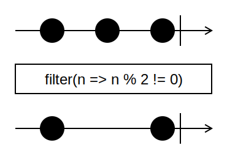

# Swirly Diagram Testrunner

Provides an easy to use way to generate a marble diagram from unit tests. 
The [Swirly](https://github.com/timdp/swirly) library is used to generate the diagrams.

At the moment it can only be used with Chai. In the future other assertion libraries will be supported.


## Example unit test


```typescript
import { DiagramTestScheduler } from "swirly-diagram-testrunner"
import { renderMarbleDiagram } from '@swirly/renderer-node';
import { styles } from '@swirly/theme-default-light';
import { DiagramSpecification } from '@swirly/types';

describe('DiagramTestScheduler', () => {
    let scheduler: DiagramTestScheduler;
    let diagram: DiagramSpecification;

    beforeEach(() => {
        scheduler = new DiagramTestScheduler();
    })

    it('should give a diagram', () => {
        diagram = scheduler.runAsDiagram('filter(n => n % 2 != 0)', ({ cold, expectObservable }) => {
            const source = cold<number>("-1-2-3|", { 1: 1, 2: 2, 3: 3 });
            const testee = source.pipe(filter(n => n % 2 !== 0));

            expectObservable(testee).toBe("-1---3|", { 1: 1, 3: 3 })
        })
        console.log("diagram %o", diagram);
    });

    afterEach(() => {
        const r = renderMarbleDiagram(diagram, { styles })
        console.log(r.xml);
    })
})

```
